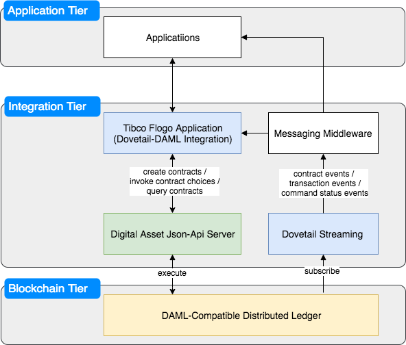
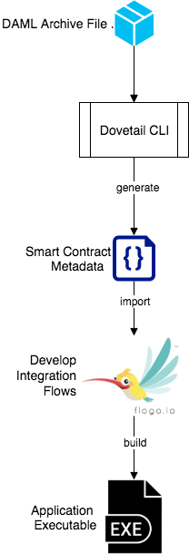

DAML integration project provides tools and components to facilitate simple and easy integration with DAML-compatible distributed ledgers. Developers can use Tibco Enterprise Flogo Studio or Tibco Cloud Flogo Integration to create daml client applications using Dovetail Flogo Extensions for DAML.

  

## List of Components

- **Dovetail Flogo Extensions for DAML**: provides connectors and activities to create and execute smart contracts
  * [Import DAML Metadata Connector](Dovetail-DAML-Client/connector/contract/README.md)
  * [DAML Ledger Service Connector](Dovetail-DAML-Client/connector/connector/README.md)
  * [Create Contract Activity](Dovetail-DAML-Client/activity/createcontract/README.md)
  * [Exercise Activity](Dovetail-DAML-Client/activity/exercise/README.md)
  * [Query Activity](Dovetail-DAML-Client/activity/query/README.md)

- **Dovetail CLI DAML Parser** 

    Extracts metadata of templates and choices from DAR file, the metadata is then imported into flogo studio to develop DAML integration applications.

- **Dovetail Event Server for DAML** 

    Emits events of contract creation, contract archival and command status to a messaging middleware, at present, Kafka is supported, others will be supported in the future.

    These events can be used to trigger flogo flows or other event-driven client applications, they can also consumed by rules engine, such as Tibco BusinessEvents, to create more complex state-driven client applications.

## Development Process

  

### Contributing

New activites, triggers, connectors and blockchain containers are welcome. If you would like to submit one, follow the instructions in the contributions section on the [documentation page](https://tibcosoftware.github.io/dovetail/ch03-00-contribute.html)

## License
dovetail-contrib is licensed under a BSD-type license. See [LICENSE](https://github.com/TIBCOSoftware/dovetail-contrib/blob/master/LICENSE) for license text.

### Support
For Q&A you can contact us at tibcolabs@tibco.com.
